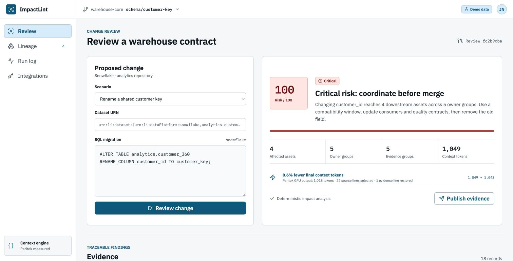

# ImpactLint

[](https://github.com/Paritok-official/paritok-4b-v1)
[](LICENSE)

ImpactLint reviews proposed warehouse schema changes against catalog metadata before they reach production. It parses SQL, traces downstream lineage, scores risk from ownership, tags, and quality signals, then produces a migration plan and CI-friendly review artifacts.

**Live demo:** [impactlint.vercel.app](https://impactlint.vercel.app) | **Demo video:** [YouTube (1:48)](https://youtu.be/I5Kou4vthdM)



The project is built for the 2026 DataHub Agent Hackathon and Paritok Token Efficiency Hackathon. It supports a self-contained fixture mode as well as live [DataHub MCP](https://github.com/acryldata/mcp-server-datahub) reads and writes. Built with [Paritok](https://github.com/Paritok-official/paritok-4b-v1) to compress the evidence packet on its hosted GPU before downstream reasoning.

## Workflow

1. Parse the proposed migration into a structured SQL AST with `sqlglot`.
2. Read schema, lineage, ownership, tags, and quality metadata through DataHub MCP.
3. Compute field-aware blast radius and a deterministic, evidence-backed risk score.
4. Segment the normalized review and raw entity response, then compress them on Paritok's hosted GPU.
5. Generate a migration plan, dbt guard, review manifest, and compressed-context sample.
6. Publish the review as a DataHub document and tag the source asset through MCP.

ImpactLint never invents token savings. The Paritok result is shown only after a successful hosted GPU response; otherwise the model step is marked as skipped. Its extractive evidence guard accepts only complete lines found in the original DataHub context, rejects model rewrites, and restores required change, asset, lineage, and risk lines before reporting the final token count.

## Measured live run

On August 2, 2026, the checked-in customer-key scenario ran against a local DataHub quickstart through the official MCP server and Paritok's hosted GPU:

| Measurement | Result |
| --- | ---: |
| Original DataHub review context | 7,635 tokens |
| Raw Paritok model output | 2,476 tokens |
| Guarded final context | 2,475 tokens |
| Final reduction | 67.6% |
| Original lines selected | 75 |
| Required evidence lines | 18 checked, 1 restored |
| Protected identifiers | 25 checked, 0 restored |

The captured, non-secret result is available in [`examples/live-review-summary.json`](examples/live-review-summary.json). Hosted latency and compression output can vary between runs.

The public demo uses the reproducible fixture catalog and the real Paritok hosted API. Its smaller input intentionally produces a lower reduction than the full DataHub MCP response above; both views report exact model-output and guarded-final counts.

Generated migration files from the public scenario are checked into [`examples/customer-key-review`](examples/customer-key-review) for inspection without running the application.

## Local development

Requirements: Python 3.12+, `uv`, Node.js 20+, and npm.

```bash
uv sync
npm install
npm --prefix frontend install
npm run dev
```

Open `http://127.0.0.1:5173`. The API runs at `http://127.0.0.1:8000`.

## Configuration

Fixture mode requires no account or API key. Set values from `.env.example` in a local `.env` to enable live integrations.

```dotenv
IMPACTLINT_MODE=fixture
DATAHUB_MCP_URL=http://localhost:8001/mcp
DATAHUB_MCP_TOKEN=
PARITOK_API_URL=https://www.paritok.com/api
PARITOK_API_KEY=
PARITOK_MODEL=paritok-4b-v1
```

Secrets in `.env` are ignored by Git.

## Deployment

ImpactLint deploys as one FastAPI application on Vercel. The API serves the built React client and the `/api` routes from the same origin. Configure `IMPACTLINT_MODE=fixture` and add `PARITOK_API_KEY` as a sensitive environment variable, then deploy:

```bash
npx vercel --prod
```

`.vercelignore` prevents local secrets, virtual environments, generated data, and build output from entering the deployment source bundle.

## Live DataHub demo

Start a local DataHub quickstart, seed the demo graph, and run the official MCP server:

```bash
datahub docker quickstart
uv run scripts/seed_datahub.py
git clone https://github.com/acryldata/mcp-server-datahub.git ../mcp-server-datahub
./scripts/start_datahub_mcp.sh
```

Set `IMPACTLINT_MODE=datahub`, then start ImpactLint with `npm run dev`. The seeded catalog contains four datasets, one Looker dashboard, field-level lineage, owners, tags, and quality signals. DataHub's local UI is available at `http://localhost:9002`.

`DATAHUB_MCP_REPO` can override the sibling MCP checkout used by the startup script.

## Hosted Paritok demo

Create a free API key in the [Paritok dashboard](https://www.paritok.com/dashboard), set `PARITOK_API_KEY`, and run a review. ImpactLint sends bounded, line-oriented segments to `POST /api/compress`; the response produces:

- Exact original, raw model-output, and guarded final token counts
- Tokens saved and reduction percentage
- Selected-source and restored-evidence line counts
- `artifacts/paritok-context.txt`, containing the verified final context
- Usage associated with the API key in Paritok's official dashboard

## Verification

```bash
npm test
npm run lint
npm run build
```

The backend suite covers SQL parsing, impact scoring, official DataHub MCP payload normalization, exact multi-hop lineage, API behavior, and hosted Paritok success/failure handling. The frontend suite covers the primary review flow.

## License

Apache License 2.0. See `LICENSE`.
